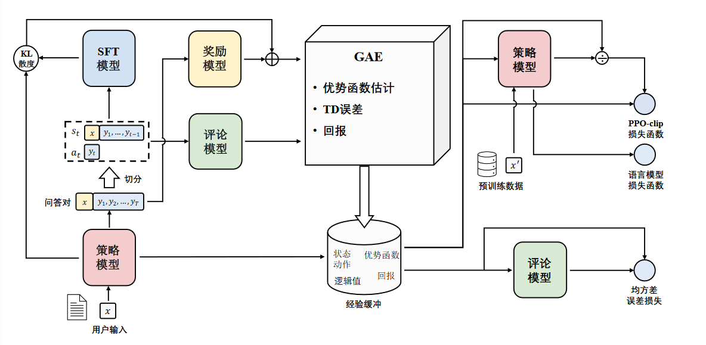
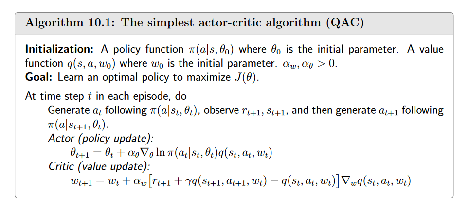
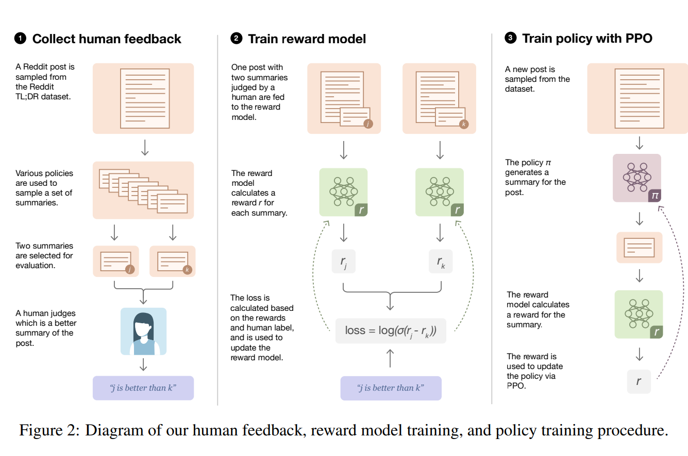

# RLHF

- SFT使用交叉熵来作为损失函数 目标是调整参数使模型输出于标准答案完全相同，不能从整体上对模型输出质量进行判断
- RLHF将模型输出文本作为一个整体进行考虑，优化目标是使得模型生成高质量回复
- RLHF不依赖人工编写的高质量回复

## RLHF的介绍

- RLHF的作用
    - 强化学习比有监督学习更可以考虑整体影响
    - 更容易解决幻觉问题(定制奖励函数，将正确答案赋予高分，放弃回答的答案赋予中低分，而不正确的答案赋予非常高的负分)
    - 更好解决多轮对话奖励累积问题
- RLHF的动机
    - 让模型与人类价值观进行对齐 满足帮助性、真实性以及无害性
- 过程
    - 奖励模型训练和近端策略优化
    - 奖励模型通过由人类反馈标注的偏好数据来学习人类的偏好 判断模型回复的有用性和内容的无害性。奖励模型模拟了人类的偏好信息，能够不断地为模型的训练提供奖励信号。



- PPO涉及到四个模型
    - 策略模型 生成模型的回复
    - 奖励模型 输出奖励分数来评价回复质量的好坏
    - 评论模型 预测回复的好坏，可以在训练过程中实时调整模型 选择对未来累积收益最大的行为
    - 参考模型 提供SFT模型的备份 帮助模型不会出现过于极端的变化
- PPO优化流程
    - 环境采样：策略模型基于给定输入生成一系列的回复，奖励模型则对这些回复进行打分获得奖励
    - 优势估计：利用评论模型预测生成回复的未来未来累积奖励，并借助广义优势估计(generalized advantage estmation, GAE)算法来估计优势函数，能够有助于更准确地评估每次行动的好处
    - 优化调整，利用优势函数来优化和调整策略模型，同时利用参考模型确保更新的策略不会有太大的变化，维持模型的稳定性
- 奖励模型的构建
    - 数据收集
        - HH-RLFH:针对有用性和无害性搜集数据
    - 模型训练
        - 奖励模型通常也采用Transformer架构的预训练语言模型
        - 奖励模型一处最后一个非嵌入层，在最终的Transformer层上叠加了一个额外的线性层。无论输入的是何种文本，奖励模型能为文本序列中的最后一个token分配一个标量奖励值，将本质量越高，奖励值越大。
        - 数据集中：每一对包含一个首选样本和一个非首选样本 每一对样本的模型损失定义为 $L(\phi)=log\ \sigma(r(x,y_w)-x(x,y_l))$ 当差值越大时 通过log损失约接近0
        - 引入了模仿学习的思想， $r'$和 $r$是相同的模型，只有最顶层的线性层与 $r$不同，该线性层的维度与词汇表的大小相对应，在 $r’$模型中 $r'(x,y_w)$表示在给定输入提示 $x$和 首选输出 $y_w$的条件下的似然概率
            
            $L(\phi)=-\lambda E_{(x,y_w,y_l)\backsim D_{rm}} [log \sigma(r(x,y_w)-r(x,y_l))]+\beta_{rm} E_{(x,y_w)\backsim D_{rm}}[log(r’(x,y_w))]$
            
        - 还可以引入附加项到奖励函数中，基于学习得到的强化学习策略 $\pi_{\phi}^{RL}$ 与初始监督模型 $\pi^{SFT}$之间的KL散度
            - $r_{total} = r(x,y) - \eta KL(\pi^{RL}_{\phi}(y|x),\pi^{SFT}(y|x))$
- 近端策略优化(PPO)
    - 策略梯度
        - 使用梯度上升得到 $\nabla \bar R_\theta = \frac{1}{N}\sum_{n=1}^N \sum_{t=1}^{Tn} R(\tau^n)\nabla log\ p_\theta (a_t^n |s_t^n)$
        - 为了克服归一化、采样不均匀带来的影响 在回报项上减去一个基线
        - 不是每个动作的奖励都相同，考虑到交互过程中actor采取的action只对之后的状态产生影响，不对之前有影响 故而 $R(\tau^n) =\sum_{t'=1}^{T_n} r_{t'}^n$
    - 广义优势估计
        - 将状态-动作对 $(s,a)$的梯度权重抽象为 $Q(s,a)-V(s)$
        - 从蒙特卡洛方法到时序差分，方差逐渐减小，偏差逐渐增大, $k$步优势可以为
        $A^k_t = r_t+\gamma r_{t+1}+..+\gamma^{k-1}r_{t+k-1}+\gamma^kV(s_{t+k})-V(s_t)$
        - 蒙特卡洛方法高方差、无偏差、而时序差分低方差、高偏差、为了权衡方差与偏差，广义优势估计(GAE)方法将优势函数定义 $k$步优势的指数平均 
        $A_t^{GAE(\gamma, \lambda)} = (1-\lambda)(A^1_t + \lambda A_t^2 + \lambda^2 A^3_t+…)$
        - 定义 $TD-error$ 得到 $\delta_t = r_t + \gamma V(s_{t+1})-V(s_t)$
        $GAE(\gamma, 0): A_t = \delta_t = r_t + \gamma V(s_{t+1})-V(s_t)$
            
            $GAE(\gamma, 1): A_t = \sum_{t=0}^\infty \gamma^l \delta_{t+l} = \sum_{t=0}^\infty \gamma^l r_{t+l}-V(s_t)$
            
    - 重要性采样
        - 策略梯度 分为On-Policy和Off-policy 近端策略优化就是策略梯度的off-policy版本
        - 想要计算p分布下函数 $f(x)$ 的期望，但是无法从p分布采样 只能从分布q采用 则
            
            $E_{x\backsim p}[f(x)]=\int f(x)\frac{p(x)}{q(x)}q(x)dx = E_{x\backsim q}[f(x)\frac{p(x)}{q(x)}]$ 通过乘一个重要性权重  $\frac{p(x^i)}{q(x^i)}$来修正两个分布的差异 被称为重要性采样
            
    - PPO
        - 混合重要性策略 优势函数等 最终策略梯度为
            
            $\nabla \bar R_\theta = E_{(s_t,a_t)\ \pi_{\theta'}}[\frac{p_\theta(s_t,a_t)}{p_{\theta'}(s_t,a_t)}A^{\theta' }(s_t,a_t)\nabla \log p_\theta(a_t|s_t)]$
            
        - 重要性采样的一个重要稳定性保证是 分布p和分布q不能差别太多，故而使用近端策略优化使用 $KL$散度来约束 $\theta$和 $\theta’$使之尽可能相似
    - PPO变种
        - PPO-Penalty和PPO-CLIP对KL散度进行处理
- MOSS-RLHF实践
    - Reward mode:
        
        ```python
        # reward model的训练
        logits = self.reward_head(output.last_hidden_state[:, -1, :]).squeeze(-1)
        probs = torch.sigmoid(preferred_rewards - rejected_rewards)
        loss = (-torch.log(probs + 1e-5)).mean()
        
        ```
        

## LLM 与 RL结合

RL的目标：在一个给定状态下，选择哪一个行为是最优的

迁移到GPT生成任务为：在一个给定的句子下，选择(续写)哪一个字是最优的。在句子生成任务中，每一个字的生成都会同等重要的影响着最后生成句子的好坏。所以在评分时候，只会针对最后生成的完整句子进行一个打分。

同时为了RL模型距离SFT模型不要太远，限制RL仅在初始模型(SFT)的附近进行探索

$R(x,y)=r_\theta(x,y)-\beta log[\pi_\phi^{RL}(y|x)/\pi^{SFT}(y|x)]$

### Advantage Actor Critic(A2C)

Policy Gradient 的梯度为 $\nabla_\theta J(\theta) = \sum_{t=0}\nabla_\theta log\ \pi_\theta(a_t|s_t)R(\tau)$

$R(\tau)$是无偏的，但是方差大，不稳定，为了解决 $R(\tau)$引入critic model.



## RLHF详解



### reward model 训练

由Advantage Actor Critic(A2C)算法知道，critic实际上估计的是action value,reward model作为environment model给奖励值,本质是一样的。在一阶段训练reward model，也是在训练 critic model。在二阶段两者初始化一样。

reward model输入为 prompt + answer,隐藏层的最后一层为 $bs\times sequence\_length \times D$ 通过 $D\times 1$的线性层输出为 $bs\times sequence\_length$，意味着：序列首位到第 $i$个位置的累积奖励。

```python
hidden_states = transformer_outputs[0]
ewards = self.v_head(hidden_states).squeeze(-1)  #bs×length×D->bs×length
# 选取有效长度 answer中首位到padding的前一位
c_truncated_reward = chosen_reward[divergence_ind:end_ind]
r_truncated_reward = rejected_reward[divergence_ind:end_ind]
# 对在answer上padding前的每一个位置都计算loss
loss += -torch.log(torch.sigmoid(c_truncated_reward - r_truncated_reward)).mean()
```

### policy model


actor  model, reference model是SFT模型 reward model和critic model是reward 模型

PPO为

$\text{ratio} = \frac{\pi_{\theta_{\text{new}}}(a_t | s_t)}{\pi_{\theta_{\text{old}}}(a_t | s_t)}$ $L^{\text{CLIP}}(\theta) = \mathbb{E}_t \left[ \min \left( \text{ratio} \cdot \hat{A}_t, \text{clip}(\text{ratio}, 1 - \epsilon, 1 + \epsilon) \cdot \hat{A}_t \right) \right]$
$\hat{A}_t$是优势函数估计  $\epsilon$是裁剪范围 通过取最小值，PPO限制策略更新的幅度，使其不超过一定范围。

核心是计算优势函数估计 $\hat{A}_t = \delta_t + (\gamma \lambda) \delta_{t+1} + \cdots + (\gamma \lambda)^{T-t+1} \delta_{T-1}$  通过优势估计值advantage来优化actor model和critic model

```python
output = self.actor_model(seq, attention_mask=attention_mask)
output_ref = self.ref_model(seq, attention_mask=attention_mask)
logits = output.logits
logits_ref = output_ref.logits
return {
# 分别得到两个模型在真实单词上的预测概率
'logprobs': gather_log_probs(logits[:, :-1, :], seq[:, 1:]),
'ref_logprobs': gather_log_probs(logits_ref[:, :-1, :], seq[:,1:]),
}
# 计算kl散度，log_probs里边存的数字经过log变化了，因此减法就对应除法
kl_divergence_estimate = -self.kl_ctl * (log_probs - ref_log_probs)
```

- 可以得到actor model的输出 reference model的输出，并通过KL散度来约束搜索空间

```python
# reward_score数据维度为(B,)，表示对于prompt+answer的打分
reward_score = self.reward_model.forward_value(
                output , attention_mask,
                prompt_length=self.prompt_length)['chosen_end_scores'].detach(
                )
#values为(B,L)，L维度上第i个位置代表从首位到i位置的累积奖励
#舍去最后一个位置是因为句子“终止符”无意义 
values = self.critic_model.forward_value(
                output, attention_mask, return_value_only=True).detach()[:, :-1]
```

- 对output 的进行评分 得到reward_score 为总体评分，values为累积奖励

```python
rewards = kl_divergence_estimate
# 只考虑answer部分的奖励，不考虑prompt
start = prompts.shape[1] - 1
# 不考虑padding部分
ends = start + action_mask[:, start:].sum(1)
reward_clip = torch.clamp(reward_score, -self.clip_reward_value,
                         self.clip_reward_value)
batch_size = log_probs.shape[0]
# 在L维度上，每个位置都有KL散度，但是只在最后一个位置加上奖励值
for j in range(batch_size):
    rewards[j, start:ends[j]][-1] += reward_clip[j]
```

- PPO训练的奖励值考虑KL散度和reward模型的输出综合评分 ，只考虑answer的KL散度 将reward model的输出加到KL散度L维度的最后一个位置，作为最终的奖励值

```python
def get_advantages_and_returns(self, values, rewards, start):
    # values（B，L） critic model输出
    # rewards（B，L）reward 包含kl散度
    # start answer开始的位置
    lastgaelam = 0
    advantages_reversed = []
    length = rewards.size()[-1]
    # 计算每个时刻（序列位置）的critic model预测误差
    for t in reversed(range(start, length)):
        nextvalues = values[:, t + 1] if t < length - 1 else 0.0
        # critic model预测的是t到到最后一个时刻的奖励和，所以变化量delta可以用如下公式表示
        delta = (rewards[:, t] + self.gamma * nextvalues) - values[:, t]
        # self.gamma=1，self.lam=0.95是衰减因子，表示之前计算的delta对现在影响越来越小
        lastgaelam = delta + self.gamma * self.lam * lastgaelam
        advantages_reversed.append(lastgaelam)
    advantages = torch.stack(advantages_reversed[::-1], dim=1)
    # 后续用来更新critic model用
    returns = advantages + values[:, start:]
    return advantages.detach(), returns
```

- delta对应于 $δ=(r_t+γV_{t+1})−V_t$ rewards是ref和policy模型的KL散度加上reward models的评分，而 value是预估的值
    - 产生了核心引文：**没道理为 把KL散度作为rewards?**
- 最终得到了advantages 和returns 使用advantage更新policy model使用 return更新critic model

```python
def actor_loss_fn(self, logprobs, old_logprobs, advantages, mask):
    ## policy gradient loss
    #logprobs, old_logprobs都是经过log变化的单词概率，这里带着log做减法就相当于在做概率除法
    log_ratio = (logprobs - old_logprobs) * mask
    # 指数操作去掉log
    ratio = torch.exp(log_ratio)
    pg_loss1 = -advantages * ratio
    pg_loss2 = -advantages * torch.clamp(ratio, 1.0 - self.cliprange,
                                            1.0 + self.cliprange)
    pg_loss = torch.sum(torch.max(pg_loss1, pg_loss2) * mask) / mask.sum()
    return pg_loss
def critic_loss_fn(self, values, old_values, returns, mask):
    ## value loss
    # 用“老critic model”的输出约束“新critic model”不要步子太大，裁剪一下
    values_clipped = torch.clamp(
        values,
        old_values - self.cliprange_value,
        old_values + self.cliprange_value,
    )
    vf_loss1 = (values - returns)**2
    vf_loss2 = (values_clipped - returns)**2
    vf_loss = 0.5 * torch.sum(
        torch.max(vf_loss1, vf_loss2) * mask) / mask.sum()
    return vf_loss
```

## DPO

RLHF的两步核心目标

- 训练reward model $max_{r_\phi}\{E_{(x,y_win,y_loss)\backsim D}[log \sigma(r_\phi(x,y_{win})-r_\phi(x,y_{loss}))]\}$
- 使用PPO算法来提升模型的得分 $max_{\pi_\theta}\{E_{x\backsim D,y\backsim \pi_\theta(y|x)}[r_\phi(x,y)] - \beta D_{KL}[\pi_\theta(y|x)||\pi_{ref}(y|x)]]\}$

但是下面这个有显式解

$\max_{\pi_\theta} \left\{ \mathbb{E}_{x \sim \mathcal{D}, y \sim \pi\theta(y|x)} \left[ r_\phi(x, y) \right] - \beta D_{KL} \left[ \pi_\theta(y|x) \| \pi_{\text{ref}}(y|x) \right] \right\} \\= \max_{\pi_\theta} \mathbb{E}_{x \sim \mathcal{D}, y \sim \pi\theta(y|x)} \left[ r_\phi(x, y) - \beta \log \frac{\pi_\theta(y|x)}{\pi_{\text{ref}}(y|x)} \right]\\= \min_{\pi_\theta} \mathbb{E}_{x \sim \mathcal{D}, y \sim \pi\theta(y|x)} \left[ \log \frac{\pi_\theta(y|x)}{\pi_{\text{ref}}(y|x)} - \frac{1}{\beta} r_\phi(x, y) \right]\\= \min_{\pi_\theta} \mathbb{E}_{x \sim \mathcal{D}, y \sim \pi\theta(y|x)} \left[ \log \frac{\pi_\theta(y|x)}{\pi_{\text{ref}}(y|x) e^{r_\phi(x, y)/\beta}} \right]$

$\pi^*(y|x) = \pi_{\text{ref}}(y|x) e^{r_\phi(x, y)/\beta} / \mathcal{Z}(x)$ 分母归一化

$\min_{\pi_\theta} \mathbb{E}_{x \sim \mathcal{D}, y \sim \pi\theta(y|x)} \left[ \log \frac{\pi_\theta(y|x)}{\pi_{\text{ref}}(y|x) e^{r_\phi(x, y)/\beta}} \right] \\
= \min_{\pi_\theta} \mathbb{E}_{x \sim \mathcal{D}, y \sim \pi\theta(y|x)} \left[ \log \frac{\pi_\theta(y|x)}{\pi^*(y|x)} - \log \mathcal{Z}(x) \right]\\
= \min_{\pi_\theta} \mathbb{E}_{x \sim \mathcal{D}, y \sim \pi\theta(y|x)} \left[ \log \frac{\pi_\theta(y|x)}{\pi^*(y|x)} \right]\\
= \min_{\pi_\theta} \mathbb{E}_{x \sim \mathcal{D}} D_{KL} (\pi_\theta(y|x) \| \pi^*(y|x))$

RLHF 训练希望得到的最优的概率分布就是 $π^*$

则 $r_\phi(x, y) = \beta \log \frac{\pi^*(y|x)}{\pi_{\text{ref}}(y|x)} + \beta \log \mathcal{Z}(x)$ 带入到reward model中的loss

$\max_{\pi_\theta} \left\{ \mathbb{E}_{(x, y{\text{win}}, y_{\text{lose}}) \sim \mathcal{D}} \left[ \log \sigma \left( \beta \log \frac{\pi_\theta(y_{\text{win}}|x)}{\pi_{\text{ref}}(y_{\text{win}}|x)} - \beta \log \frac{\pi_\theta(y_{\text{lose}}|x)}{\pi_{\text{ref}}(y_{\text{lose}}|x)} \right) \right] \right\}$

核心为 off-policy

参考资料：

张奇老师 复旦大学 [大规模语言理论:从理论到实践](https://intro-llm.github.io/)

RLHF: [RLHF RL究竟是如何与LLM做结合的](https://zhuanlan.zhihu.com/p/675329917)

A2C: [critic扮演的角色](https://huggingface.co/blog/deep-rl-a2c)

PPO代码实现： [Deepspeed的代码实现](https://github.com/microsoft/DeepSpeedExamples/blob/master/applications/DeepSpeed-Chat/dschat/rlhf/ppo_trainer.py#L308)

DPO简化RLHF: [推导了DPO简化RLHF的过程](https://zhuanlan.zhihu.com/p/671780768)