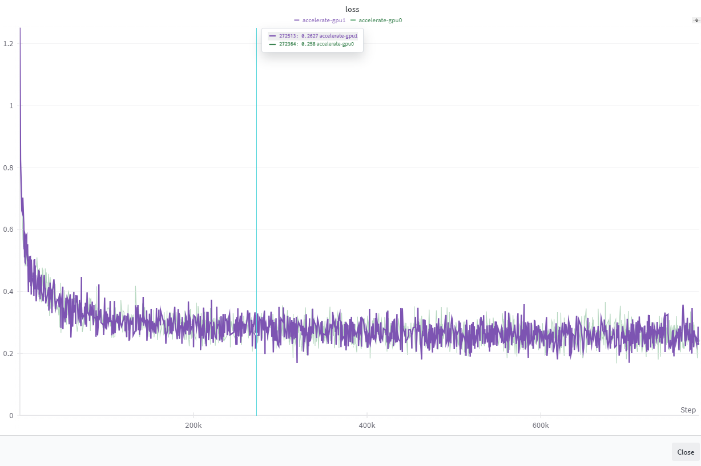
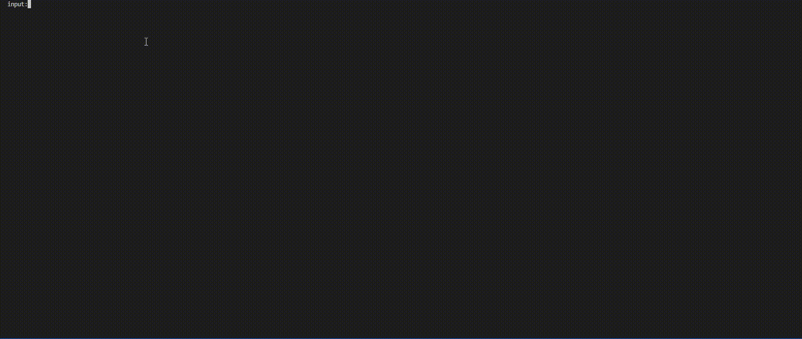
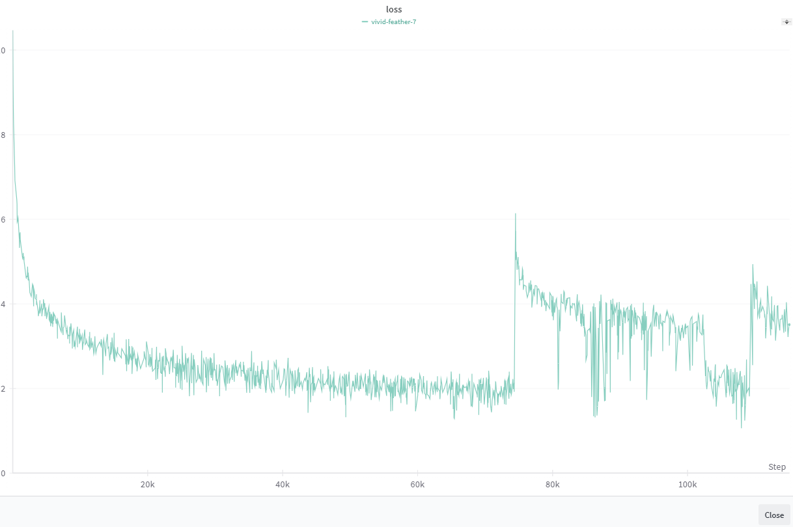

# LLama3
llama2和llama3好像没有什么架构上的区别,主要看了transformers的LlamaForCausalLM实现，进行了架构上的复现   
## model architecture
* 激活函数使用了 SiLU 
* 位置编码是RoPE 挺有意思的 理论和代码还是挺有区别的 特别是在维度上的处理
* mlp没有dropout

> attention_mask和loss_mask的启发：[baby-llama2-chinese](https://github.com/DLLXW/baby-llama2-chinese)  
> 和小伙伴讨论了一下，有以下的启发：
> 无论是pre_trained 和 sft的阶段 无论是否padding   
> 文本处理：pretrained直接文本拼接 不同文本用<eos>连接 而在padding阶段为<question>+<bos>+<answer>+<eos>+padding 到最大序列   
> attention_mask:都使用下三角和对角线为0 上三角为-inf的矩阵，因为核心理解为attention_mask 序列逐一预测 $\sum log \pi(t_i|t_{i-1}...t_0)$
> loss_mask:pretrained直接计算loss 而sft对padding和prompt进行系数掩码 系数为0

## Pretraining Training data
* Wikipedia使用了 [zhwiki](https://dumps.wikimedia.org/zhwiki/)   
  * 使用了20240520下的Recombine articles, templates, media/file descriptions, and primary meta-pages. 共2.4GB
  * bz2转换为wiki.txt参考了 [WikiExtractor](https://github.com/apertium/WikiExtractor) 
  * 只用Wikipedia来训练tokenizer 
  * 可以参考T5_model/src/data的数据预处理
* [firefly-train-1.1M](https://huggingface.co/datasets/YeungNLP/firefly-train-1.1M)
  * 收集了23个常见的中文数据集，对于每个任务，由人工书写若干种指令模板，保证数据的高质量与丰富度，数据量为115万 
* [Llama3中文数据集](https://modelscope.cn/datasets/baicai003/Llama3-Chinese-dataset/files)
  * shareAI整理的数据集
  * 其中1_0_firefly_chinese_common_task_1649k.jsonl 重复了 我删除了该项
* [ruozhiba](https://huggingface.co/datasets/LooksJuicy/ruozhiba)   
  * 经典弱智吧    

处理的代码路径为src/data/process_raw_data.py   
最终在fast总数据集大小为1.7GB(使用fastparquet的write)
在这个过程中遇到的问题：  
* 数据保存使用fastparquet 而读取使用pandas 默认读取出来为bytes
* 数据集1.7G pandas读取时间长   

解决如下
```python
import dask.dataframe as dd
import pandas as pd

start_time = time.time()
# 通过指定engine 解决了第一个问题
data = pd.read_parquet('LLama3/dataset/processed/pretrain_data.parquet', engine='fastparquet')
print(time.time() - start_time, len(data))
# 70s左右

start_time = time.time()
data = dd.read_parquet('LLama3/dataset/processed/pretrain_data.parquet')
print(time.time() - start_time, len(data))
# 0.2s
```
觉得dask.dataframe效果很好 而且相较于pandas,内存消耗更小 
64G的内存 当读取的时候，内存占用可以到40G,很奇怪

> 我又到了晚上重新尝试了一下 pd.read_parquet('LLama3/dataset/processed/pretrain_data.parquet')可以正常读了，没有b'[]'的形式 小小的脑袋大大的疑惑
## Model Pretrain
预训练使用了两种方式，一个是accelerate方式实现、一个是torchrun的方式
### accelerate方式
使用accelerate包装了一下 在运行之前，需要使用```accelerate config``` 设置一下。如果想要多卡运行，需要使用```accelerate launch --multi-gpu {.py} ```    
loss图如下：
     

由于是双卡，我将两张卡的loss都保存下来了，感觉不如使用tranformers的loss损失平滑，可能有没注意到的细节。

演示效果：

很明显有以下问题 需要解决：
* 输出重复
* 前后语境不搭
* <eos>未结束， tokenizer的时候有空格

### torchrun 双卡分布训练    
机器为i7-12700KF+64G+双卡4090
训练的时候遇到了两个问题:    
* ```train_dataloader = DataLoader(dataset, batch_size=trainConfig.batch_size // world_size, shuffle=False, collate_fn=dataset.collate_fn, num_workers=4, sampler=sampler)```会出现炸内存的情况，数据集2G 内存64G，会直接超出。(不是显存)    
  * [num_workers>0的问题](https://github.com/pytorch/pytorch/issues/13246) 通过查阅，发现是dataloader的加载的问题   
* 训练速度 accelerate在bs=12的情况下，单卡显存为14G，但是一个epoch7h，而torchrun在bs=12时，显存为10G，但是一个epoch在72h多，很奇怪      
  * 我仔细想了一下，可能是我在accelerate config中设置了bf16,改完之后，并没有变得那么快，还是六十多个小时，但是显存降到了8.4G    
  * 感觉更加奇怪的是，我将双卡torchrun(pretrain_pytorch.py)代码改为单卡训练(pretrain_model.py),bs=12时，只需要12h(默认float32),就算没有连接桥，也不应该那么慢，很amazing    
  * 欢迎帮忙修改，谢谢
  * 最终选择使用单卡训练 而不是双卡

第一次单卡训练，没训练完一个epoch意外停掉了，同时出现下图的loss
  

可能是语料中差距太大，但是accelerate没有遇到，待第二次训练； 中间发现意外，尝试使用A100，发现时间更慢了，从12h到23h


## SFT Dataset 
* [BELLE Group](https://huggingface.co/BelleGroup)   
  * 包含了[generated_chat_0.4M](https://huggingface.co/datasets/BelleGroup/generated_chat_0.4M) 和[train_0.5M_CN](https://huggingface.co/datasets/BelleGroup/train_0.5M_CN)
  * 总中文字符为274882143
* [shareAI 数据集](https://modelscope.cn/datasets/baicai003/Llama3-Chinese-dataset/summary)
  * 感觉数据质量本身非常优秀，同时作为SFT数据集
  * 和pretrained_data一样 总中文字符为455168273
* [m-a-p/COIG-CQIA](https://huggingface.co/datasets/m-a-p/COIG-CQIA)
  * shareAI数据集中包括，但感觉不完全，使用了全部
  * 总中文字符为48014083
* [lyuricky/alpaca_data_zh_51k](https://huggingface.co/datasets/lyuricky/alpaca_data_zh_51k)
  * alpaca数据集的中文
  * 总中文字符为5477887
## SFT Train
再次尝试了pandas和datasets，感觉pandas要比datasets节省内存。
使用命令 ```accelerate launch --multi-gpu {.py} ``` 代码在sft_accelerate.py

> 相关资料   
> 分词化：[BPE](https://github.com/karpathy/minbpe)   
> LLama3 from scratch: [LLama3 from scratch](https://github.com/naklecha/llama3-from-scratch) (阿尼亚很可爱)   
> RoPE: [知乎讲解 十分钟读懂旋转编码（RoPE）](https://www.zhihu.com/tardis/zm/art/647109286?source_id=1003) 