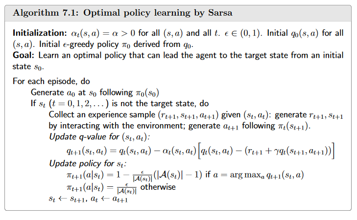

# 强化学习基础

- 基础的概念
    - state\state space\action\ action space of a state\state transition\foridden area\state transition probability\Reward\trajectory\return\discounted rate\episode\MDP
    - MDP的两个性质
        - 下一个状态只和当前状态和执行动作有关
        - 获得的奖励只和当前状态和执行动作有关
- Belleman Equation
    - 作用:评估一个政策的优劣
    - 奖励函数、折扣因子和状态转移矩阵通常是不变的
    - 特殊形式(稳定的时候): $v=r + \gamma P v$
        - $v$ 每个状态的期望回报 $r$是当前的奖励 $\gamma$是折扣因子 $P$是状态转移矩阵
    - $v_\pi(s)=E[G_t|S_t=s]\ \  (G_t=R_{t+1}+\gamma R_{t+2}+\gamma^2 R_{t+3}+...)$
    - $v_\pi(s)=E[G_t|S_t=s]\\=\sum_{a \in A} \pi(a | s) \left[ \sum_{r \in R} p(r | s, a) r + \gamma \sum_{s' \in S} p(s' | s, a) v_{\pi}(s') \right ] \quad \forall s \in S$
        - $\pi(a|s)$是策略 但在公式中理解为在状态 $s$ 下的执行动作 $a$ 的概率
    - $v_\pi = r+\gamma P v_\pi$  (Bellman Matrix-vector形式)
        - $r=\sum_{a\in A}\pi(a|s)\sum_{r\in R} p(r|s,a)r$
        - $P = \sum_{a\in A}\pi(a|s) p(s'|s,a)$
    - 解法
        - 迭代法 矩阵求逆
- Action value
    - 动机:想知道哪个action更好，选择最好的action作为 $\pi(a|s)$
    - $q_\pi(s,a)=E[G_t|S_t=s,A_t=a]$
    - 直觉上为 $v_\pi(s)=\sum_{a\in A}  \pi(a|s)q_\pi(s,a)$
    - 故而 $q_\pi(s,a)=\sum_r p(r|s,a)r + \gamma \sum_{s'}p(s'|s,a)v_\pi(s')$
- Bellman Optimality Equation
    - 最优的策略 $v_{\pi^*}(s)≥v_\pi(s) \quad  \forall s \in S$
    - $v_\pi(s) =\underset{\pi}{max}  \sum_a\pi(a|s)q_\pi(s,a)$
    - 由线性规划得知 $\underset{\pi}{max} \sum_a \pi(a|s)q_\pi(s,a) = \underset{\pi}{max}\ q_\pi(s,a)$
- value iteration
    - $v_{k+1} = \underset{\pi}{max}(r_\pi + \gamma P_\pi v_k)$
    - 分为两步：value update→policy update 初始化值后，持续迭代
- policy iteration
    - $\pi_0 \overset{PE}{\rightarrow} v_{\pi_0}\overset{PI}{\rightarrow} \pi_1  \overset{PE}{\rightarrow} v_{\pi_1}\overset{PI}{\rightarrow} …$
    - 分为两步 PE(policy evaluation)→PI(policy improvement)
    
    
    
    
    
    两个算法 A4.1和A4.2来自于[赵世钰老师的课程](https://github.com/MathFoundationRL/Book-Mathematical-Foundation-of-Reinforcement-Learning)
    
    state value的最优性等价于action value的最优性
    
- Monte Carlo
    - 动机：不需要环境的具体模型(状态转移概率和奖励函数) 使用episode来估计值函数
    - 大数定理 $q_{\pi_k}(s,a)≈\frac{1}{N}\sum^N_{i=1}g^{(i)}(s,a)$ 避免了求 $p(r|s,a)$和 $p(s'|s,a)$ (客观上存在，但是求解算法中不需要知道)
        
        
        
- Generalized policy iteration (让MC算法更加简洁 优化)
    
    
    
    - 从后向前做来提高计算效率
    - 为什么需要考虑exploring starts 确保每一个 $(s,a)$ 都visit,为了去除exploring starts引入了soft policies
        - $\epsilon-greedy$ policies
            
            $\pi(a|s) = \begin{cases}
            1 - \frac{\epsilon}{|A(s)|} (|A(s)| - 1), & \text{for the greedy action}, \\
            \frac{\epsilon}{|A(s)|}, & \text{for the other } |A(s)| - 1 \text{ actions},
            \end{cases}$
            
- Temporal-Difference Learning
    - 动机：从MC到TD是从非迭代到迭代
    - 为什么需要迭代：MC算法需要等到一个epsode结束之后才能求解，而TD在每一步更新值函数，进行在线学习,提升效率
- TD(0)
    - 最简单的TD learning方法，每一步更新state value
    - 输入为 $\{(s_t,r_{t+1},s_{t+1})\}_t$
    - .png)
    - 就是直接迭代
- Sarsa
    - 用来估计action value
    - $q_{t+1}(s_t, a_t) = q_t(s_t, a_t) - \alpha_t(s_t, a_t) \left[ q_t(s_t, a_t) - \left( r_{t+1} + \gamma q_t(s_{t+1}, a_{t+1}) \right) \right]$
    - 在数学上是 $q_\pi(s,a)=E[R+\gamma q_\pi(s',a')|s,a],\forall s,a$
    - 使用了 $\epsilon -greedy$
    - 需要和policy imporovement结合
    
    
    - Expeted Sarsa和n-step Sarsa 是对 $q_t(s_{t+1},a_{t+1})$的估计
- Q-learning(TD learning of optimal action values)
    - $q_{t+1}(s_t,a_t)=q_t(s_t,a_t)-\alpha_t(s_t,a_t)[q_t(s_t,a_t)-(r_{t+1}+\gamma \underset{a\in A(s_{t+1})}{max}q_t(s_{t+1},a))]$
    - 优化目标是optimal action value
    - off-policy vs on-policy (a behabvior policy 和 a target policy)
        - behavior policy是用来产生experience samples 而 target policy 是 不断地更新到最优策略
        - 两者相同是on-policy 两者不同是off-policy
        - Q-learning是off-policy
    
    
    
- value function approximation—Deep Q-learning
    - 之前的方法都是基于表格的，想要从表格转向函数拟合(提升效率,连续的动作空间)
    - function approximation 拟合的是action value
    - 最小化目标函数 $J=E[(R+\gamma \underset{a\in A(S')}{max}\hat q(S',a,w)-\hat q(S,A,w))^2]$
    - $q(s,a)=E[R_{t+1}+\gamma \underset{a\in A(S_{t+1})}{max}q(S_{t+1},a)|S_t=s,A_t=a],\forall s,a$
- Policy Gradient Methods
    - 使用函数来拟合policies $\pi_\theta(a|s)$
    - 如何定义最优策略
        - Average state value $\hat v_\pi = \sum_{s\in S}d(s)v_\pi(s) = E_{S\backsim d}[v_\pi(S)]$
            - $d(s)$的选择 1. $\frac{1}{|s|}$均匀分布 2.依赖于政策 $\pi$的平稳分布 满足 $d^T_\pi P_\pi = d_\pi^T$
        - Average reward $\hat r_\pi = \sum d_\pi(s)r_\pi(s)=E_{S\backsim d_\pi}[r_\pi(S)]$
        - 
        
    - $\nabla_\theta J(\theta) =\sum_{s\in S} \eta(s) \sum_{a\in A} \nabla_\theta \pi(a|s,\theta)q_\pi(s,a)\\=E_{S\backsim \eta,A\backsim \pi(S,\theta)}[\nabla_\theta ln \pi(A|S,\theta)q_\pi(S,A)]$

## Actor-Critic Methods

- 核心为最大化期望 $J(\theta)$ 即为 $\theta_{t+1}=\theta_{t}+\alpha E_{s\backsim \eta, A\backsim \pi}[\nabla_\theta \ln \pi(A|S,\theta_t)q_\pi(S,A)]$
    - $\theta_{t+1}=\theta_t +\alpha \nabla_\theta \ln \pi(a_t|s_t,\theta_t)q_t(s_t,a_t)$
    - Actor为policy upadate  Critic为value update

## 参考资料
赵世钰老师的强化学习课程：[赵世钰老师的课程](https://github.com/MathFoundationRL/Book-Mathematical-Foundation-of-Reinforcement-Learning)