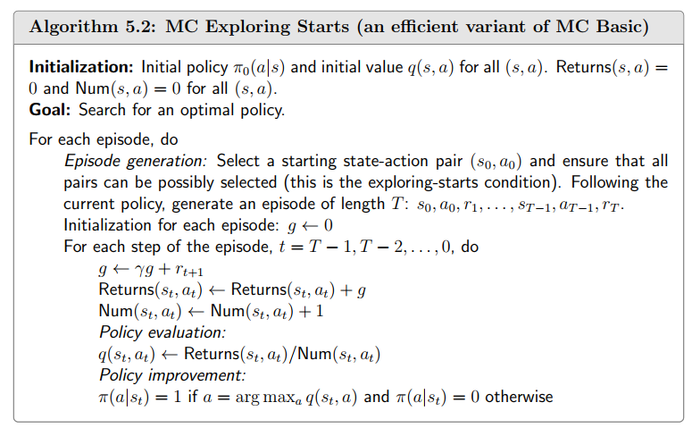

- 基础的概念
    - state\state space\action\ action space of a state\state transition\foridden area\state transition probability\Reward\trajectory\return\discounted rate\episode\MDP
    - MDP的两个性质
        - 下一个状态只和当前状态和执行动作有关
        - 获得的奖励只和当前状态和执行动作有关
- Belleman Equation
    - 作用:评估一个政策的优劣
    - 奖励函数、折扣因子和状态转移矩阵通常是不变的
    - 特殊形式(稳定的时候): $v=r + \gamma P v$
        - $v$ 每个状态的期望回报 $r$是当前的奖励 $\gamma$是折扣因子 $P$是状态转移矩阵
    - $v_\pi(s)=E[G_t|S_t=s]\ \  (G_t=R_{t+1}+\gamma R_{t+2}+\gamma^2 R_{t+3}+...)$
    - $v_\pi(s)=E[G_t|S_t=s]\\=\sum_{a \in A} \pi(a | s) \left[ \sum_{r \in R} p(r | s, a) r + \gamma \sum_{s' \in S} p(s' | s, a) v_{\pi}(s') \right ] \quad \forall s \in S$
        - $\pi(a|s)$是策略 但在公式中理解为在状态 $s$ 下的执行动作 $a$ 的概率
    - $v_\pi = r+\gamma P v_\pi$  (Bellman Matrix-vector形式)
        - $r=\sum_{a\in A}\pi(a|s)\sum_{r\in R} p(r|s,a)r$
        - $P = \sum_{a\in A}\pi(a|s) p(s'|s,a)$
    - 解法
        - 迭代法 矩阵求逆
- Action value
    - 动机:想知道哪个action更好，选择最好的action作为 $\pi(a|s)$
    - $q_\pi(s,a)=E[G_t|S_t=s,A_t=a]$
    - 直觉上为 $v_\pi(s)=\sum_{a\in A}  \pi(a|s)q_\pi(s,a)$
    - 故而 $q_\pi(s,a)=\sum_r p(r|s,a)r + \gamma \sum_{s'}p(s'|s,a)v_\pi(s')$
- Bellman Optimality Equation
    - 最优的策略 $v_{\pi^*}(s)≥v_\pi(s) \quad  \forall s \in S$
    - $v_\pi(s) =\underset{\pi}{max}  \sum_a\pi(a|s)q_\pi(s,a)$
    - 由线性规划得知 $\underset{\pi}{max} \sum_a \pi(a|s)q_\pi(s,a) = \underset{\pi}{max}\ q_\pi(s,a)$
- value iteration
    - $v_{k+1} = \underset{\pi}{max}(r_\pi + \gamma P_\pi v_k)$
    - 分为两步：value update→policy update 初始化值后，持续迭代
- policy iteration
    - $\pi_0 \overset{PE}{\rightarrow} v_{\pi_0}\overset{PI}{\rightarrow} \pi_1  \overset{PE}{\rightarrow} v_{\pi_1}\overset{PI}{\rightarrow} …$
    - 分为两步 PE(policy evaluation)→PI(policy improvement)
    
    
    
    
    
    两个算法 A4.1和A4.2来自于[赵世钰老师的课程](https://github.com/MathFoundationRL/Book-Mathematical-Foundation-of-Reinforcement-Learning)
    
    state value的最优性等价于action value的最优性
    
- Monte Carlo
    - 动机：不需要环境的具体模型(状态转移概率和奖励函数) 使用episode来估计值函数
    - 大数定理 $q_{\pi_k}(s,a)≈\frac{1}{N}\sum^N_{i=1}g^{(i)}(s,a)$ 避免了求 $p(r|s,a)$和 $p(s'|s,a)$ (客观上存在，但是求解算法中不需要知道)
        
        
        
- Generalized policy iteration (让MC算法更加简洁 优化)
    
    
    
    - 从后向前做来提高计算效率
    - 为什么需要考虑exploring starts 确保每一个 $(s,a)$ 都visit,为了去除exploring starts引入了soft policies
        - $\epsilon-greedy$ policies
            
            $\pi(a|s) = \begin{cases}
            1 - \frac{\epsilon}{|A(s)|} (|A(s)| - 1), & \text{for the greedy action}, \\
            \frac{\epsilon}{|A(s)|}, & \text{for the other } |A(s)| - 1 \text{ actions},
            \end{cases}$
            
- Temporal-Difference Learning
    - 动机：从MC到TD是从非迭代到迭代
    - 为什么需要迭代：MC算法需要等到一个epsode结束之后才能求解，而TD在每一步更新值函数，进行在线学习
- TD(0)
    - 最简单的TD learning方法，每一步更新值函数