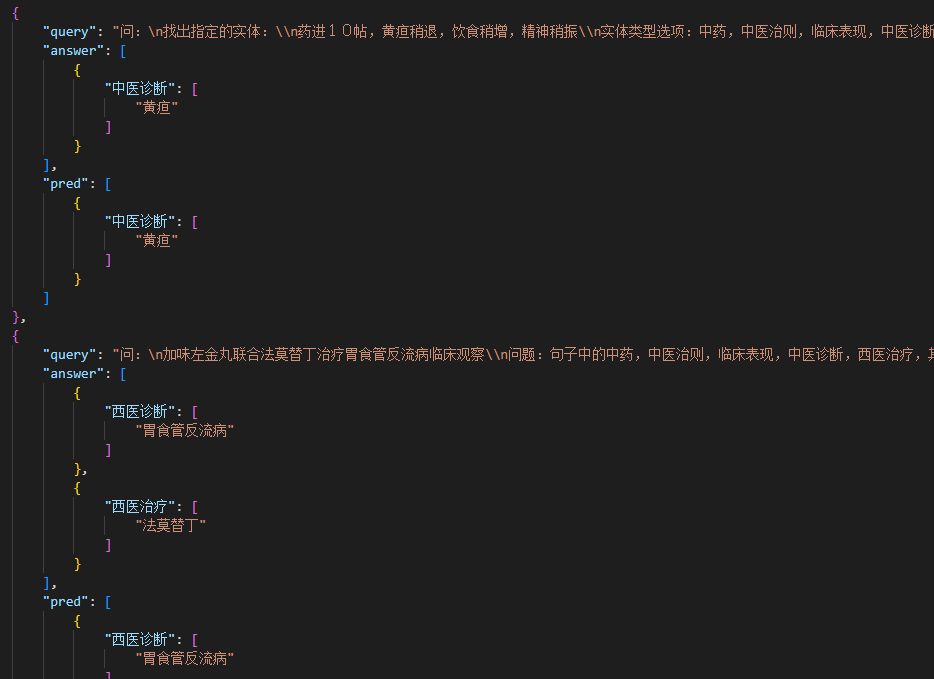

# Medicine_LLM
使用真实的医疗数据集，将命名实体识别等分类任务转变成文本生成任务
## Data
数据集在[data](data)目录下，原本的输入格式为一个token一个标签

通过接下来的模板将输入模板化
```python
template = [
    "找出指定的实体：\\n[INPUT_TEXT]\\n类型选项：[LIST_LABELS]\\n答：",
    "找出指定的实体：\\n[INPUT_TEXT]\\n实体类型选项：[LIST_LABELS]\\n答：",
    "找出句子中的[LIST_LABELS]实体：\\n[INPUT_TEXT]\\n答：",
    "[INPUT_TEXT]\\n问题：句子中的[LIST_LABELS]实体是什么？\\n答：",
    "生成句子中的[LIST_LABELS]实体：\\n[INPUT_TEXT]\\n答：",
    "下面句子中的[LIST_LABELS]实体有哪些？\\n[INPUT_TEXT]\\n答：",
    "实体抽取：\\n[INPUT_TEXT]\\n选项：[LIST_LABELS]\\n答：",
    "医学实体识别：\\n[INPUT_TEXT]\\n实体选项：[LIST_LABELS]\\n答："
  ]
```
处理的代码在[create_data.py](create_data.py)   
处理后的数据如下
```python
{
        "input": "实体抽取：\\n投活络效灵丹加味：当归、丹参各１５ｇ，生乳香、生没药各６ｇ，柴胡１２ｇ，白芍、黄芩、大黄各１０ｇ，蒲公英３０ｇ，甘草５ｇ\\n选项：中药，中医治则，临床表现，中医诊断，西医治疗，其他治疗，中医治疗，方剂，西医诊断，中医证候\\n答：",
        "task_type": "ner",
        "task_dataset": "custom_data",
        "sample_id": "train_0",
        "answer_choices": ["中药","中医治则","临床表现","中医诊断","西医治疗","其他治疗","中医治疗","方剂","西医诊断","中医证候"],
        "target": "上述句子中的实体包含：\n方剂实体：活络效灵丹\n中药实体：当归\n中药实体：丹参\n中药实体：生乳香\n中药实体：生没药\n中药实体：柴胡\n中药实体：黄芩\n中药实体：大黄\n中药实体：蒲公英\n中药实体：甘草"
    }
```

## 模型训练
采用了accelerate实现的DDP,梯度累积为8，使用了分布式训练DDP, 2*RTX4090上，使用了LoRA进行模型的微调c_attn(r=8)，训练模型参数比仅为0.05%。同时将不同数据集条数拼接在一起，节省token。
在测评的时候使用了rouge和blue指标。
结果如下:

训练代码在[train](train.py)

## 评估
通过模板模型进行了结构化输出，通过处理得到最终的结果，评估代码为[eval_model.py](eval_model.py)


