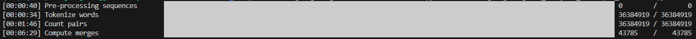
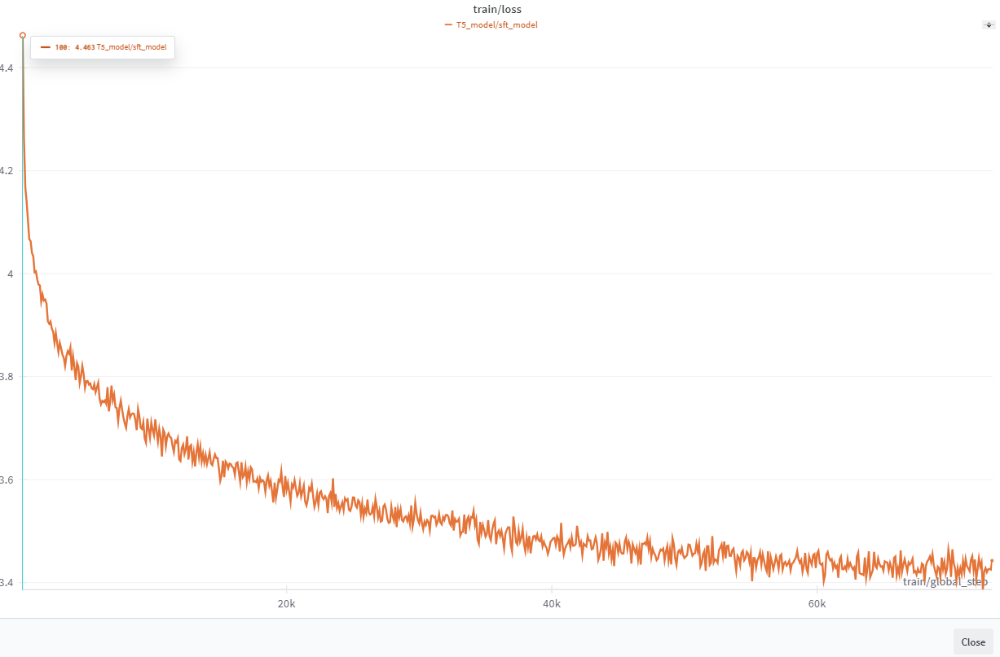
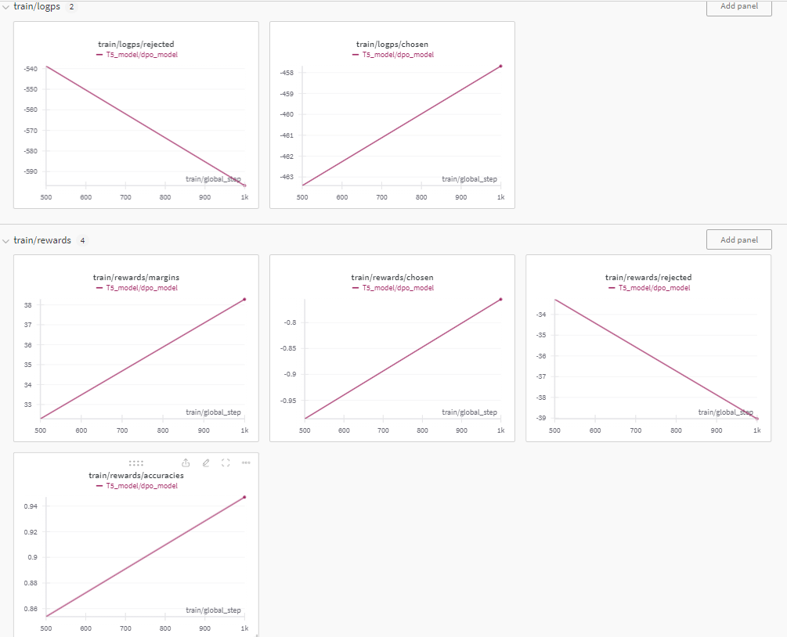
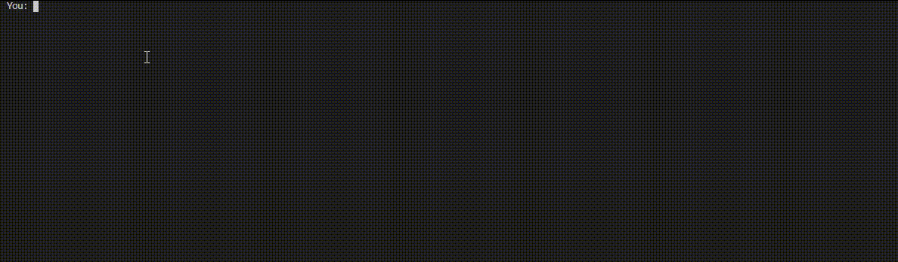

# T5

此项目仿照 [ChatLM-mini-Chinese](https://github.com/charent/ChatLM-mini-Chinese?tab=readme-ov-file)  
从预训练到微调，使用DPO，包含数据预处理   
总参数量在1.3亿
## T5 architecture
* T5 是encoder-decoder的架构，从文本到文本的生成模型  
  * 即encoder出来的特征作为key和value， decoder出来的特征作为query进行attention操作
* position embedding
  * 不是直接加在特征上 而是在每一层加入
* 计算loss忽略的-100的token  
  * 即在计算batch进行padding的时候，padding_label=-100 让其不进行loss计算
## Dataset
数据仿照[ChatLM-mini-Chinese](https://github.com/charent/ChatLM-mini-Chinese?tab=readme-ov-file)  
改动如下：  
* 没有使用医药领域数据集
* belle数据集没有找到Belle_open_source_1M,使用了Belle_open_source_1M.json\school_math_0.25M.json\train_2M_CN.json
* Wikipedia使用了 [zhwiki](https://dumps.wikimedia.org/zhwiki/)   
  * 使用了20240520下的Recombine articles, templates, media/file descriptions, and primary meta-pages. 共2.4GB
  * bz2转换为wiki.txt参考了 [WikiExtractor](https://github.com/apertium/WikiExtractor) 

预训练数据集预处理在src/raw_data_process.py

## Pre_tokenizer
只使用Wikipedia的简体语料，作为分词的数据集
本项目只采用了BPE分词，处理如下   
*  进行NFKC()正则化
*  pre_tokenizer为符号分开 数字分开(单独) 并且按照空格分开且替换为_   

数据集总大小为1.6GB 在62.6G上 i7-12700KF，一次训练整个语料会出现swap,且非常卡。   
选择进行buffer迭代缓冲进行训练，且训练的tokenizer保存为两个class 一种是tokenizer，一个是PreTrainedTokenizerFast，时间在10min左右。

## Model Train(Transformers)
模型训练，我理解共分为以下几个步骤   
* Tokenizer的实例化
* ModelConfig和模型的实例化
* 数据集的加载 包括加载、分词化(同时进行padding和截断)
* 进行训练参数的实例化和collator
* 模型训练

在项目[ChatLM-mini-Chinese](https://github.com/charent/ChatLM-mini-Chinese?tab=readme-ov-file)中，虽然在collator中选择了max_length,但是padding=True 所以无效了，我最终选择在数据集加载中，处理数据集,对数据进行截断，prompt和response的长度限制在了256。   

.png)
## Model Train(PyTorch)
使用了自己实现的T5model，在训练和评估的时候 都使用了交叉熵做为loss进行计算   
风格为pytorch实现的模型训练方式   
代码为pre_train_model.py 模型路径在src/models下面 包含了自己实现的Dataset和model。   
问题在于loss根本没收敛,很奇怪(可能我实现的有问题，痛苦，欢迎大佬帮忙解决)    

.png)

## SFT Train(Transformers)

数据采用了[BELLE](https://huggingface.co/BelleGroup)的generated_chat_0.4M、train_0.5M_CN和train_2M_CN  
处理的数据集的路径在src/data/sft_data_process.py
在微调的过程中,冻结了embedding的层   
epoch为2，进行SFT训练：   

## DPO Train(Transformers)
将SFT训练两论后最好的模型,作为model和reference
现有的DPO数据为[Skepsun/huozi_rlhf_data_json](https://huggingface.co/datasets/Skepsun/huozi_rlhf_data_json)、[beyond/rlhf-reward-single-round-trans_chinese](https://huggingface.co/datasets/beyond/rlhf-reward-single-round-trans_chinese)、[beyond/rlhf-reward-single-round-trans_chinese](https://huggingface.co/datasets/beyond/rlhf-reward-single-round-trans_chinese)   
同时对[llm-wizard/alpaca-gpt4-data-zh](https://huggingface.co/datasets/llm-wizard/alpaca-gpt4-data-zh)进行处理,rejected为训练两轮后的回答，但是model的generation为默认形式，导致语录中好多重复的，后面可以通过修改generation的配置文件，来增强数据集，处理在src/data/sft_data_process.py 
DPO的训练loss和rewards还是有点没看懂，再接再厉呢!~
数据集格式参考[DPO Trainer](https://huggingface.co/docs/trl/en/dpo_trainer)
epoch为2，进行DPO Trainer:   

## 效果
加载DPO Train 2epochs后的模型，进行对话，效果如下：   

## 总结
T5_model学会了以tranformers的形式，从pre_trained到sft到RLHF(DPO)的过程，了解了encoder-decoder的模型架构(未成功复现，todo),于我而言，对预训练祛魅了,感觉和sft没什么区别。   
整个项目，其实没有训练到尽头，从loss上来看，还有下降的空间，但本项目以学习为主，效果为辅，谢谢。
