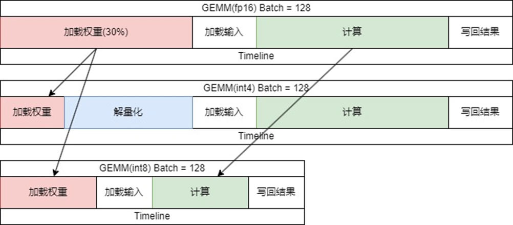

# Efficiently Serving LLMs
## Text generation

预填充和解码，用KV cache缓存优化来加快注意力计算的速度

模型包含三种类型： encoder-decoder/encoder/decoder

流程上为 tokenizer→ model → argmax → tokenizer.decoder → torch.cat()

- KV cache


paged-cache等技术 更加具有优势

## Batched

将多个请求一起批处理，处理更多请求的同时(吞吐量)和快速相应任何一个请求(延迟)之间进行权衡

在多个输入请求下，需要引入padding，以使每个输入在尺寸上保持一致，这样有了一个形状规则的张量，看起来像是一个普通的2D矩阵。

在推理阶段，padding和truncation一般在序列的开始，同时添加了position_id的概念，当使用KV-cache时，position_id也只需要一位，给出对应的id


当使用batch时候，考虑吞吐量大于延迟，达到一定的批次在进行推理，但这将会导致延迟非常严重(较大的batch_size)

## Continuous Batching

使用迭代的逐词文本生成过程来获得高吞吐量和低延迟推理的最佳效果

按照请求的达到顺序贪婪的逐token处理请求，但在看到一个新请求时，完成一个特定token后，决定是否继续将改请求合并到现在的批处理中，就可以继续一起生成token，从而获得吞吐量的优势

如果请求在不同时间完成，那么它们要么在较早时间开始，要么要生成的标记数较少，它们遇到eos token,那么就可以有效地从批处理中删除其中一个序列，并将其替换为另一个等待轮到的请求。

Continuous Batching: 不断地在批处理中移动元素的想法，即使有些元素可能在某段时间内保留

在连续批处理中，通常会将所有这些预加载和解码步骤作为单独的批处理来处理

```python
# seed the random number generator so our results are deterministic
random.seed(42)

# constants
queue_size = 32
batch_size = 8

# requests waiting to be processed
# this time requests are tuples (prompt, max_tokens)
request_queue = [
    (prompts[0], 100 if i % batch_size == 0 else 10)
    for i in range(queue_size)
]

t0 = time.time()
with tqdm(total=len(request_queue), desc=f"bs={batch_size}") as pbar:
    # first, let's seed the initial cached_batch
    # with the first `batch_size` inputs
    # and run the initial prefill step
    batch = init_batch(request_queue[:batch_size])
    cached_batch = generate_next_token(batch)
    request_queue = request_queue[batch_size:]

    # continue until both the request queue is 
    # fully drained and every input
    # within the cached_batch has completed generation
    while (
        len(request_queue) > 0 or
        cached_batch["input_ids"].size(0) > 0
    ):
        batch_capacity = (
            batch_size - cached_batch["input_ids"].size(0)
        )
        if batch_capacity > 0 and len(request_queue) > 0:
            # prefill
            new_batch = init_batch(request_queue[:batch_capacity])
            new_batch = generate_next_token(new_batch)
            request_queue = request_queue[batch_capacity:]

            # merge
            cached_batch = merge_batches(cached_batch, new_batch)

        # decode
        cached_batch = generate_next_token(cached_batch)

        # remove any inputs that have finished generation
        cached_batch, removed_indices = filter_batch(cached_batch)
        pbar.update(len(removed_indices))

duration_s = time.time() - t0
print("duration", duration_s)
```

过滤批处理： 首先从批处理中删除已达到终端状态的元素(生成终止，最大token)然后将执行与合并步骤相反的操作，从开始删除多余的填充标记，调用过滤批处理函数时，得到两个结果：一个是可能执行剩下需要生成的内容的较小的缓存批次，另一个是在此步骤中被移除的批次中的索引列表 

流式处理的关键，从系统中逐个获取token，并迅速的将结果返回给用户。

## Quantization

即使量化，也需要让model.dtype为torch.float32 

得到内存占用: **`model.get_memory_footprint()`** 


并不需要那么大的量级，用更少的比特数来表述大致相同数量的信息的方法

通过量化，不关心用更少的位表示相同的信息，更关心的是如何将数据压缩为一种压缩形式，包含一些元数据，这些元数据可以在前向传播及时重构，来节省内存开销，并支付一小部部分计算成本，但在压缩方面获得明显的好处。

### Zero-point Quantization

计算最小值和最大值，然后将其压缩到一个介于0和255之间的范围值，仅仅使用无符号整型

```python
def quantize(t):
    # obtain range of values in the tensor to map between 0 and 255
    min_val, max_val = t.min(), t.max()

    # determine the "zero-point", or value in the tensor to map to 0
    scale = (max_val - min_val) / 255
    zero_point = min_val

    # quantize and clamp to ensure we're in [0, 255]
    t_quant = (t - zero_point) / scale
    t_quant = torch.clamp(t_quant, min=0, max=255)

    # keep track of scale and zero_point for reversing quantization
    state = (scale, zero_point)

    # cast to uint8 and return
    t_quant = t_quant.type(torch.uint8)
    return t_quant, state
def dequantize(t, state):
    scale, zero_point = state
    return t.to(torch.float32) * scale + zero_point
```
## LLMs基础

大预言模型的基本结构：

1. LayerNorm 2. Attention 3.Silu 4.MatMul 5.Rotary Embedding 6.KV Cache

核心是矩阵乘法计算 

大语言模型推理两阶段：1. Prefill 2.Decoding

- Prefill 是将所有输入的token都计算
- Docoding是进行输出 输入为最新的唯一token 和KV cache深度绑定

LLM Benchmark

- Thoughtput(吞吐量) 吞吐量是指在给定的时间内模型能够处理的任务或请求的数量。在大语言模型的上下文中，吞吐量通常表示模型在一定时间内生成的词（tokens）数量。
- First Token Latency(首字延迟) 首字延迟指的是从发送请求到模型开始生成第一个输出词所花费的时间。
- Latency(延迟) 延迟通常指的是模型从接收到输入请求到完全生成出结果之间的时间，包括所有的计算和通信开销。
- QPS(每秒请求量) 系统或模型在一秒钟内能够处理的请求数量。这个指标衡量的是系统在高负载下的处理能力。

LLM 推理的子过程


- Tokenize
- Computing
- Detokenize
- Sampling(argmax很快 但是Top-P等操作不容易)

## 优化操作

### 流水线前后处理与高性能采样


detokenize在CPU上，让下一次计算和detokenizer同时计算：使用流水线策略将 Tokenize(CPU), Computing(GPU), Detokenize(CPU)之间的延迟相互掩盖，这将提升系统5%~10%的QPS .

使用更高性能的采样算子将提升系统的10%-20%的QPS

高性能采样算子： https://github.com/OpenPPL/ppl.llm.kernel.cuda/blob/master/src/ppl/kernel/llm/cuda/pmx/sample.cu

### 动态批处理


- PPL.LLM 能够在多用户推理中动态地重组任务，从而大幅降低用户请求延迟。
- 这将使得系统的 QPS 提升 100%。

详细操作：


在Merge Step中，用户会被分流使用两种不同的 Attention 算子，其中使用 Decoding Attention 将比 Flash attention 快 2 倍(核心问题是Attention问题 判别prefilling还是decoding)

### Decoding Attention


FlashAttention只有在Prefill才使用，decoder阶段使用Decoding Attention

- 这是一种专为 Decoding 任务设计的算子，其完全依赖 Cuda Core 完成计算，非常灵活且容易修改。
- 在 Decoding Attention 运算中，要求 Q 的长度为 1，K, V 长度可以不为 1

https://github.com/OpenPPL/ppl.llm.kernel.cuda/blob/master/src/ppl/kernel/llm/cuda/pmx/multi_head_cache_attention.cu

## VM Allocator


- LLM 使用 VM Allocator 管理内存，这是一种简单的内存机制，用于分配 KV Cache 所需的空间，并提升系统性能。
- 这将使得系统的 QPS 提升 200%，能够同时服务更多用户。


pytorch：对于每一个用户申请一个固定的长度，无论用多少，都预留那么多

page Attention: 内存中的页框 每一个页框为8个tokens，当不够的时候触发缺页异常，进行新分配，页框之间使用链表联系起来(问题：不知道系统的服务上限是多少，导致用户拥挤后掉线)

VM Allocator 训练一个模型预测实际生成的长度，然后进行开辟空间，不够的话，打回去重新生成

- 并非加入了 Page Attention 或 VM Allocator 就一定可以提升吞吐量，这与模型的显存使用情况有关。
- 上述技术可以减少 KV 缓存的显存占用，提升 batchsize，但batchsize 超过 512 时对吞吐量的提升将不再明显。
- ChatGLM2, Llama-2 慎重开 PAGE ATTENTION。这些模型使用了GQA或MQA技术压缩KV缓存，batchsize可以上千，PAGE ATTENTION 不会很有用，反而可能会拖性能。
- 当显卡本身在bs512以上，没必要在使用paged Attention 会降低decoding的速率

### Mem Offload

- 我们能否在执行期间进行 GPU - CPU 的显存切换？这是不可能的，因为通信带宽太低。并且切换操作将阻塞下一次 decoding 的到来。

GPU MEM: 2,039GB/s NVLink: 600GB/s PCIe Gen4: 64GB/s

切换 1G 的数据需要 ~ 20ms  20ms相当于停止一次decoding

## KV Cache 量化


- 在服务端推理时，KV 缓存将占据大部分显存空间，这严重限制了系统的并发请求数量
- LLM 使用极高精度的分组量化方法对 KV 缓存数据进行压缩。这使得服务端能够容纳的请求数量增加了 100%

KV cache只有self-Attention使用

```python
import torch
# 分组量化 对每8个来继续计算
# group_quantize分组量化精度比所有的都高，如果group_quantize量化不了，那么所有的精度都没有用
def group_quantize(x: torch.Tensor, group_size: int = 8):
    x = x.reshape((-1, group_size))
    scale = torch.max(x.abs(), dim=-1, keepdim=True)[0] / 127
    qt = torch.round(x / scale).char()
    return qt.flatten(), scale

def per_tensor_quantize(x: torch.Tensor):
    x = x.flatten()
    scale = torch.max(x.abs()) / 127
    qt = torch.round(x / scale).char()
    return qt.flatten(), scale

```

Attention 必须自己写，如果是导入现有库，量化毫无意义，性能下降


## 矩阵乘法的量化

服务端矩阵乘法的量化是为了加速，而不是节省缓存。

int4 weight-only不是给服务端使用，weigt-only用来压缩而不是加速


- 在服务端推理时，矩阵乘法所需的时间占整个推理的70%以上
- PPL.LLM 使用 dynamic channel-token int8 量化加速矩阵乘法(Calibration Free)。
- 这些量化同样精度极高，将提供 ~ 100% 的性能提升。

Attention中需要的操作： 权重量化(预处理)、输入需要量化(input→K V)、反量化(K,V)、矩阵乘量化，其次将算子融合

不量化 **`MatMul For O`**

东西能不能融合，需要看Cuda算子写得怎么样

### INT8 vs INT4


- INT4 Weight Only 量化适用于访存密集型的矩阵乘法。
- INT8 的量化适用于计算密集型的矩阵乘法。
- 在服务端场景下，大部分矩阵是计算密集型的，INT8 的效率高于 INT4。

weight-only解量化：解量化和权重大小和计算量都有关



int8 不需要解量化 同时计算量减半

code: https://github.com/OpenPPL/ppl.llm.kernel.cuda/pull/6

int4-weight-only和计算有关的原因

```python
def dequantize(...): pass

# X是FP16 而W是int4 解量化和bs有关
def GEMM(X, W, output):
    # X: [I, K] Matrix
    # W: [K, J] Matrix
    for k in range(K):
        for j in range(J):
            for i in range(I):
                output[i][j] += X[i][k] * dequantize(W[k][j])
```

### FP8 vs INT8

- INT8 精度高于 FP8
- 但 FP8 更好用(H800)
- 在服务端应用中 FP8~INT8 > INT4

相关知识： https://zhuanlan.zhihu.com/p/574825662

而int4-weight-only一般在手机端或终端

code： https://github.com/bitsandbytes-foundation/bitsandbytes

## 硬件


- 根据模型结构，我们可以预估所有算子的计算量与访存需求。因此我们可以预估模型在不同硬件上的推理性能（一般般准）。
- 我们提供一份神奇的表格用于帮助用户确定硬件选型。

## 相关资料
* [大语言模型推理加速](https://www.bilibili.com/video/BV128411v7us?vd_source=c717b93aea4bd7ec9f2c9664b44d7fe7)，商汤科技的公开讲座，偏向于业务，非常实际,后面所有的图都来源于该课程，非常推荐听一下
* [推理基础](https://www.deeplearning.ai/short-courses/efficiently-serving-llms/) 偏向于基础 使用GPT-2来演示各个流程