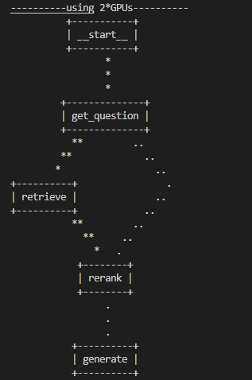

# 智能座舱知识大脑
属于RAG任务，使用现有的车主手册构建知识库，选择知识库中的相关知识用于辅助大模型生成。

方案构建流程分为三个部分: 1. 构建知识库 2. 知识检索 3. 答案生成

以大模型作为中心制作一个问答系统，回答用户的相关问题。根据问题，在文档中定位相关信息的位置，并根据文档内容通过大模型生成相应的答案。

数据集: 领克汽车的用户手册
## LangGraph
构建了LangGraph,如图所示  


## pdf解析
- pdf分块解析
    - 按照块状进行解析，每一块当作一个样本，尽可能保证pdf中文本内容的完整性
- pdf滑窗法
    - 上下文联系，但是内容跨页了，故而有滑窗法
    - 将pdf中所有内容当作一个字符串，然后按照句号分割，根据分割后的数据进行滑窗。
    - 本质为 CharacterTextSplitter的chunk_size和chunk_overlap
- 采取的解析方案为
    - pdf分块解析 尽量保证一个小标题+对应文档在一个文档块 文档块的长度分别是512和1024
    - pdf滑窗解析 把文档句号分割 构建滑动窗口 文档长度分别是256和512
    - pdf非滑窗解析 overlap为0  把文档句号分割 均匀分割 文档块的长度分别是256和512
    - 使用三种方法后，对文档快进行了去重后，将文档块输入给检索模块

## 知识检索
使用langchain中的retrievers进行文本检索，尝试了下向量检索和bm25检索，前者是深度语义检索，侧重泛化性，后者是字面检索，侧重关键词/实体的字面相关性。   
故而采用一阶段字面检索，二阶段向量检索的方法，最后Rerank。
> 实测下来字面检索感觉效果非常差，不如直接向量检索了   

向量检索 采用了GTE\BGE\M3E-large检索   

在实验中，发现- `HuggingFaceEmbeddings` 加载慢的问题 是因为其通过huggingfacehub来确定模型信息，将下面这句话屏蔽即可
```python
# 路径为sentence_transformers\SentenceTransformer.py\SentenceTransformer
if revision is None:
    path_parts = Path(modules_json_path)
    if len(path_parts.parts) >= 2:
        revision_path_part = Path(modules_json_path).parts[-2]
        if len(revision_path_part) == 40:
            revision = revision_path_part
# self.model_card_data.set_base_model(model_name_or_path, revision=revision) #屏蔽
return modules
```

## ReRank
Rerank是信息检索生态系统中的一个重要组成部分，用于评估搜索结果，并重新排序，从而提高查询结果相关性。在RAG应用中，主要在拿到找回结果后使用Reranker,能够更有效地确定文档和查询之间的语义性，更精细对结果重排，最终提高搜索质量。

将Reranker整合到RAG应用中可以显著提高生成答案的精度，因为Reranker能够在单路或多路的检索结果中挑选和问题最接近的文档。此外，扩大检索结果的丰富度(例如多路召回)配合清晰化筛选最相关结果(Reranker),能够进一步提升最终结果质量。利用Reranker可以排除掉第一层检索中和问题关系不大的内容，将输入给大模型的上下文范围进一步缩小到最相关的一小步文档中。通过缩短上下文，LLMs能够更关注上下文中的所有内容，避免忽略重点内容，节省推理成本。

Rerank使用的模型为BGE-Reranker-large\BCE-Reranker-base-v1  

>命中率(Hit Rate)
命中率计算的是在检索的前k个文档中找到正确答案的查询所占的比例。简单来说，它反映了我们的系统在前几次猜测中答对的频率。该指标越大越好。
平均倒数排名（Mean Reciprocal Rank，MRR）
对于每个查询，MRR通过查看最高排名的相关文档的排名来评估系统的准确性。具体来说，它是在所有查询中这些排名的倒数的平均值。因此，如果第一个相关文档是排名最靠前的结果，倒数排名就是1；如果是第二个，倒数排名就是1/2，依此类推。该指标越大越好。

## 模型
模型采用了Baichuan\GLM4\QWEN  
vLLM是一个基于Python的LLM推理和服务框架，它的主要优势在于简单易用和性能高效。通过PagedAttention技术、连续批处理、CUDA核心优化以及分布式推理支持，vLLM能够显著提高LLM的推理速度，降低显存占用，更好地满足实际应用需求。vLLM 推理框架使大模型推理速度得到明显提升，推理速度比普通推理有1倍的加速。在产品级的部署上，vLLM既能满足batch推理的要求，又能实现高并发下的continuous batching，在实际产品部署中应用是非常广泛的。

## 生成
* 将抽取后的文档使用LLM重新整理，使得杂乱知识库规整。然后再送入到答案生成模块，这里需要用到prompt提示工程技术。
* 先用LLM先将问题改写和扩充一遍，然后将问题和这个改写后的问题拼接，提升检索效果。
* 使用Answer Recursively, 一次给LLM一个检索到的文档，不断优化生成的答案，即利用prompt技术对LLM，context和原答案，优得到优化升级后的答案。

## 结果
模型生成 无关 答案的能力较弱，使用[test_score](test_score.py)和答案进行语义匹配，最终的得分为0.83。